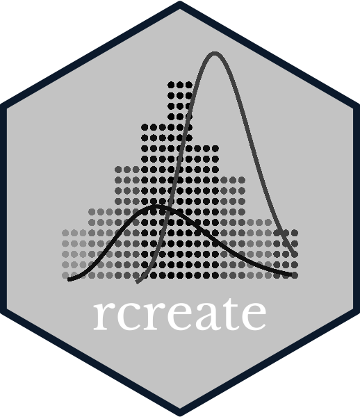
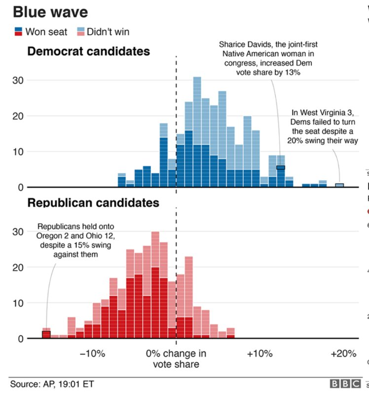
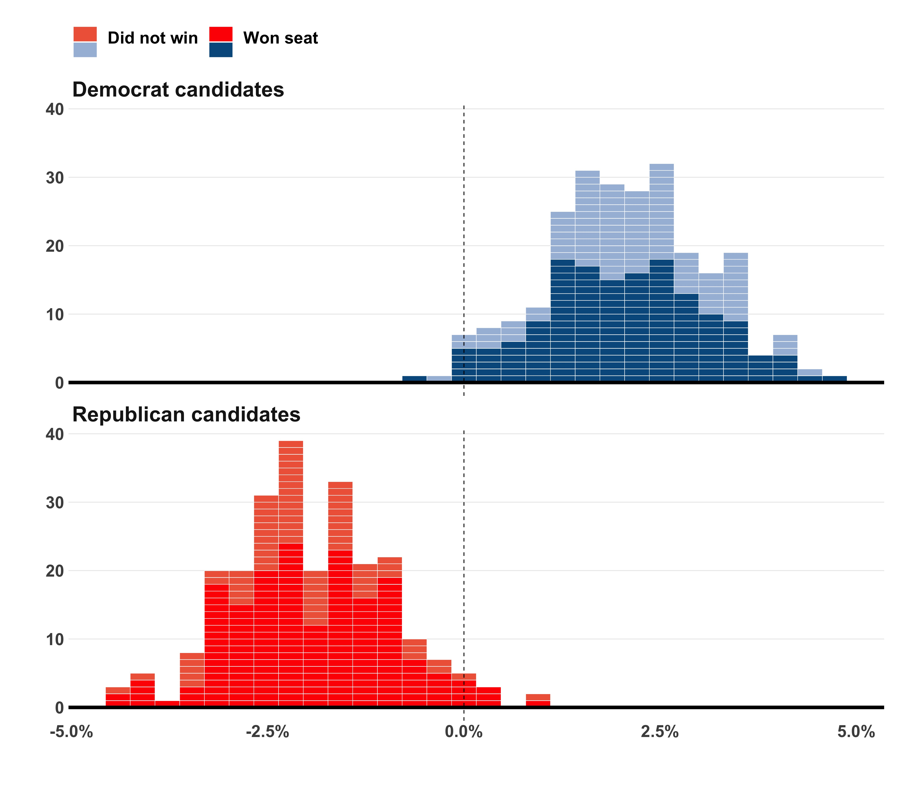
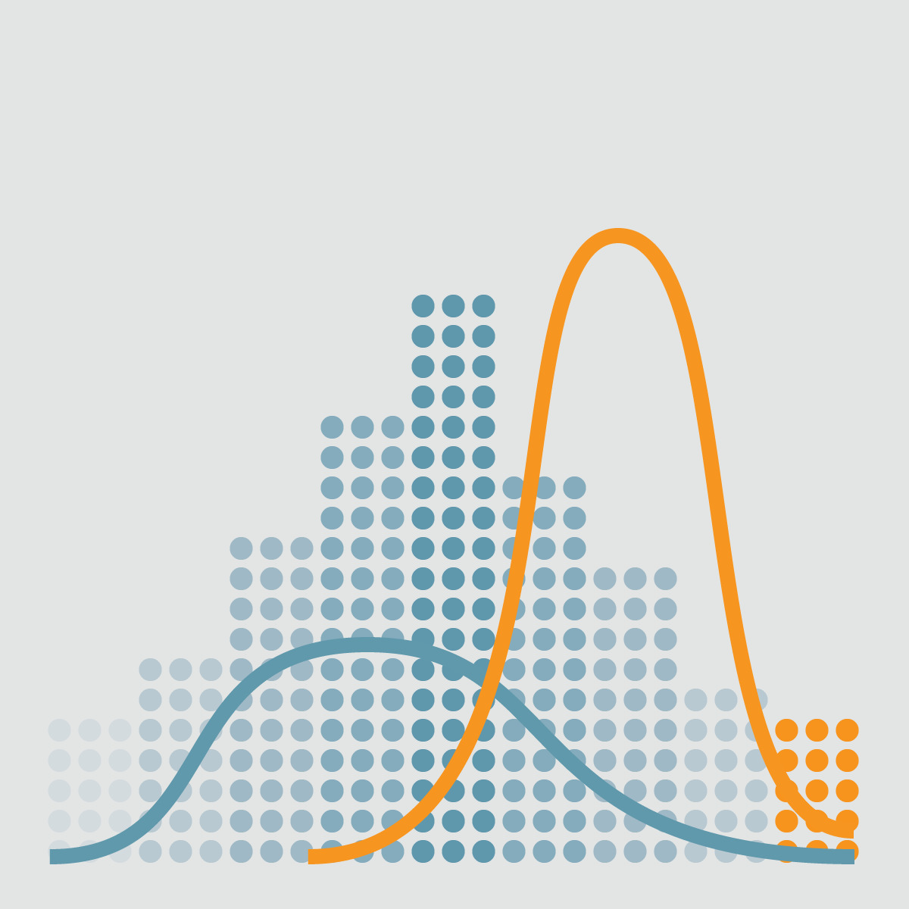
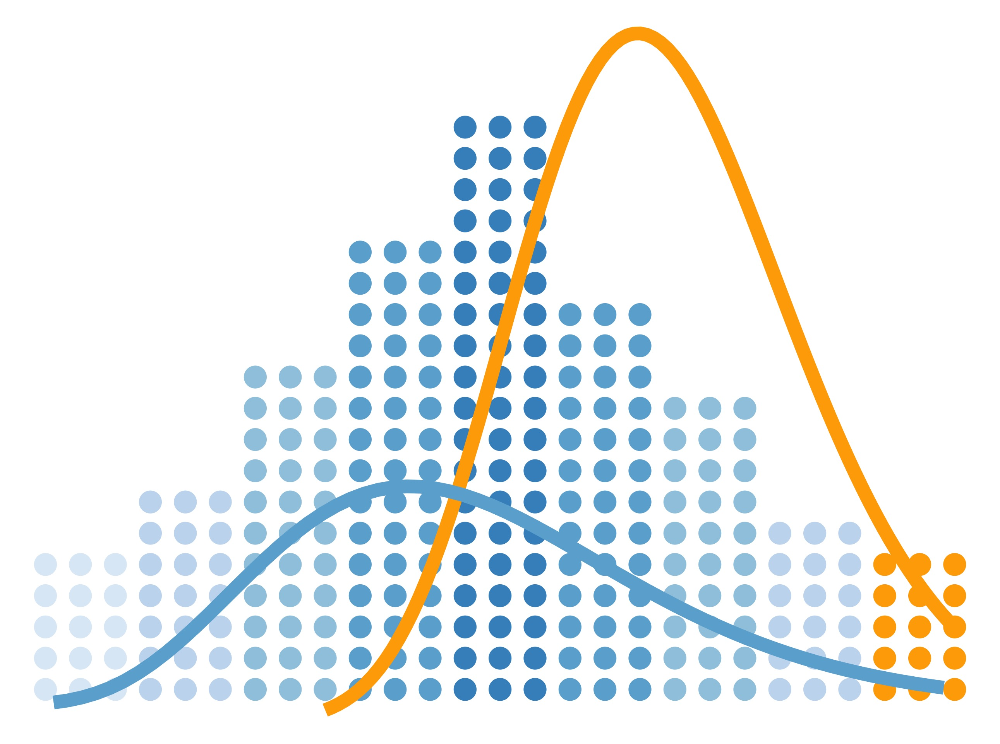

# rcreate 

# Overview

Is there a data visualization that ggplot2 can't recreate? Let's find out!  
I select charts that aren't originally made in R and rcreate them.
Originals on the left and recreated ones on the right.  
Suggestions of visualizations, feedback, or contributions are absolutely welcomed via [twitter](https://twitter.com/haro_ca_) or PR.

(Also, no copyright intended, just a repo for testing skills in R)

# Gallery
## 01. BBC style chart
original             |  rcreated
:-------------------------:|:-------------------------:
 |  

## 02. Dots and distributions
original             |  rcreated
:-------------------------:|:-------------------------:
 |  

